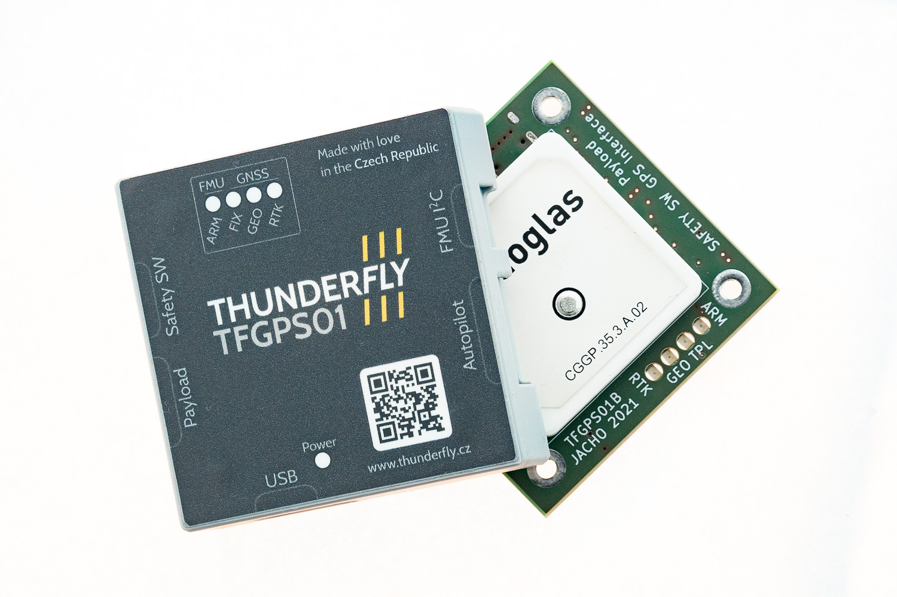

# ThunderFly multi-constellation GNSS reciever [TFGPS01](https://github.com/ThunderFly-aerospace/TFGPS01/)

The [TFGPS01](https://github.com/ThunderFly-aerospace/TFGPS01/) is a compact, multi-constellation GNSS receiver that features an integrated high-quality patch antenna. Designed to be highly resistant to external RF interference, it ensures accurate positioning during the whole flight, regardless of the surrounding conditions. This open-source receiver allows GPS data output to be shared with multiple devices, including payload that may not be integrated into the PX4 system.

The receiver is based on the U-blox NEO [M9N](https://www.u-blox.com/en/product/neo-m9n-module) module (standard configuration), with the option to assembly receiver with the U-blox [NEO M8P](https://www.u-blox.com/en/product/neo-m8-series) module for RTK technology support.

The TFGPS01 is connected to an autopilot through a cable with a [10-pin JST-GH](https://github.com/pixhawk/Pixhawk-Standards/blob/master/DS-009%20Pixhawk%20Connector%20Standard.pdf) connector, ensuring a secure and reliable connection between the receiver and the autopilot's GPS port. TFGPS01 contains a safety buzzer, ARM LED and an additional button with a beeper and LED can be connected via the own SAFETY connector output.

The I2C interface from the combined GPS port of the autopilot is available on a separate I2C connector, allowing you to connect any I2C device or sensor to the bus.

The receiver also features a payload output that provides a copy of the serial line, PPS signal, external interrupt for precise time and position tagging of the signal, I2C interface of the U-blox module, and GEO_STAT signal. This enables easy mounting of useful payloads on the drone that may not be fully implemented or supported by PX4.

The receiver contains a USB-C connector that enables it to be connected to a computer for use as a USB GPS receiver for ground station purposes or for [configuration](https://www.u-blox.com/en/product/u-center) of internal settings of the U-blox module.

The TFGPS01 is typically packaged in a plastic box, with an open-source design available on Github. This allows you to modify the box to easily incorporate it into the drone without unnecessary weight.

For more information, please refer to the [TFGPS01 documentation](https://github.com/ThunderFly-aerospace/TFGPS01/).
